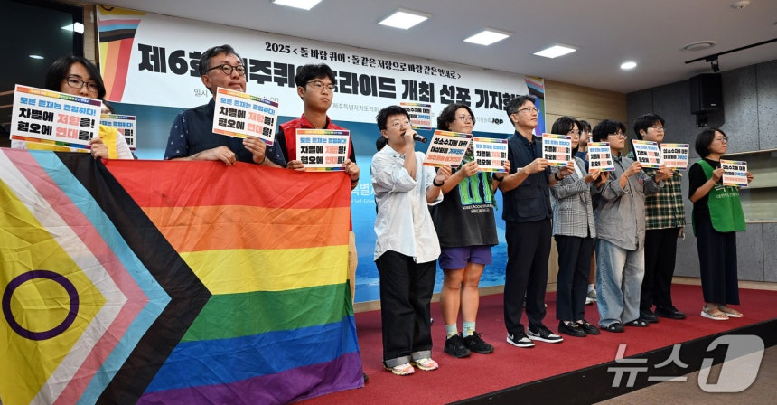

# Sexual Minority Event "Jeju Queer Pride" Being held at Ongmun Rotary on November 1st
> Are you looking for the original article? Click [here](https://n.news.naver.com/article/421/0008534121?lfrom=kakao) for more!

> At the Jeju Provincial Council resident's Cafe in the morning, Jeju Queer Pride Organizing Comitte is holding a press conference about holding the sixth Jeju Queer Pride event.

(Jeju=News1) Journalist Oh Mi-ran = Sexual minority event "Jeju Queer Pride" is going to be held on November 1st at 12 PM.

According to the Jeju Queer Pride Organizing Comitte on the 13th day of the month, the theme of the event will be "stone, wind, queer: through solidarity that is like wind with its stone-like resistence." The comitte explained that the theme was decided with the intention of "firmly resisting against discrimination and hate, expanding the equality with solidarity."

The event will happen in the following order: opening event, solidarity speeches, 'Rainbow Blessing Ceremony' where the religious figures will participate and lastly a parade to advocate for the anti-discrimination law.

At different venues around the event site, there are also going to be various hands-on activities.

Lim Choi Do-yoon, the comitte's chairperson said that "Now in its sixth year, Jeju Queer Pride is going to listen to the voice of sexual minorities who have been excluded with the Jeju's close-knit Gwaendang (Jeju dialect of "권당." It means close relations.) culture, and is going to be a safe space where sexual minorities can knock the world with the help of the society and the community."

Journalist Oh Mi-ran (mro1225@news1.kr)